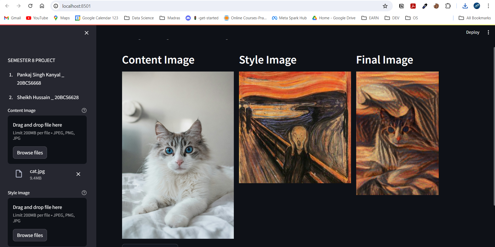

# Neural-Style-Transfer
***Abstract***— *Neural style transfer (NST) has emerged as a distinguished technique in computer vision and image processing, permitting the synthesis of pix that integrate the content of one photo with the style of another. This paper presents a thorough evaluation and assessment of NST methodologies, that specialize in current improvements and key challenges. We begin by using elucidating the fundamental concepts at the back of NST, elucidating its underlying neural community architectures, which includes the seminal Gatys et al.'s set of rules and subsequent tendencies such as feed-forward networks and perceptual loss capabilities. furthermore, we delve into the various programs of NST across diverse domains, together with inventive picture era, photo manipulation, and visible content material introduction. We analyze the strengths and boundaries of various NST approaches, considering factors such as computational efficiency, style constancy, and content material maintenance. additionally, we speak open research directions and potential avenues for reinforcing the overall performance and versatility of NST algorithms. 
Through a comprehensive synthesis of existing literature and empirical critiques, this paper affords valuable insights into the present day kingdom of NST research, providing researchers and practitioners a holistic expertise of its abilities, demanding situations, and destiny potentialities inside the realm of computer vision and image processing.*

**Keywords** – *Neural Style Transfer, Computer Vision, Image Processing, Artistic Image Generation, Style Fidelity, Content Preservation, Gatys Algorithm, CNN, VGG-19.*

### Sample outputs

